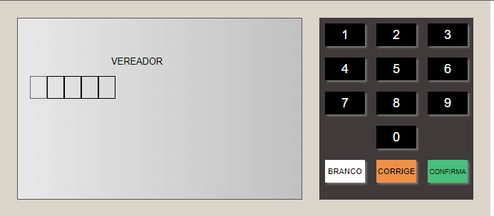
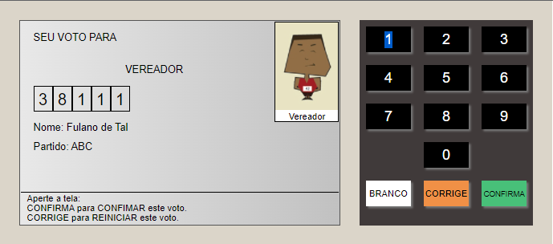

# Urna-Eletr-nica

Projeto proposto pela B7Web no curso de Javascript.

## Breve Descrição:

Este projeto tem como objetivo simular a dinâmica de uma urna eletrônica brasileira.
A estrutura e arte foram reproduzidas em Html e CSS, enquanto a dinâmica do sistema foi formulada em Javascript.

Todo o sistema está dividido em etapas, cada etapa corresponde à posição em que você deseja votar.
Quando concluídas, todas as etapas aparecem na tela com a palavra "FIM", indicando que você concluiu o processo.
A imagem abaixo mostra o desenho da primeira etapa.

